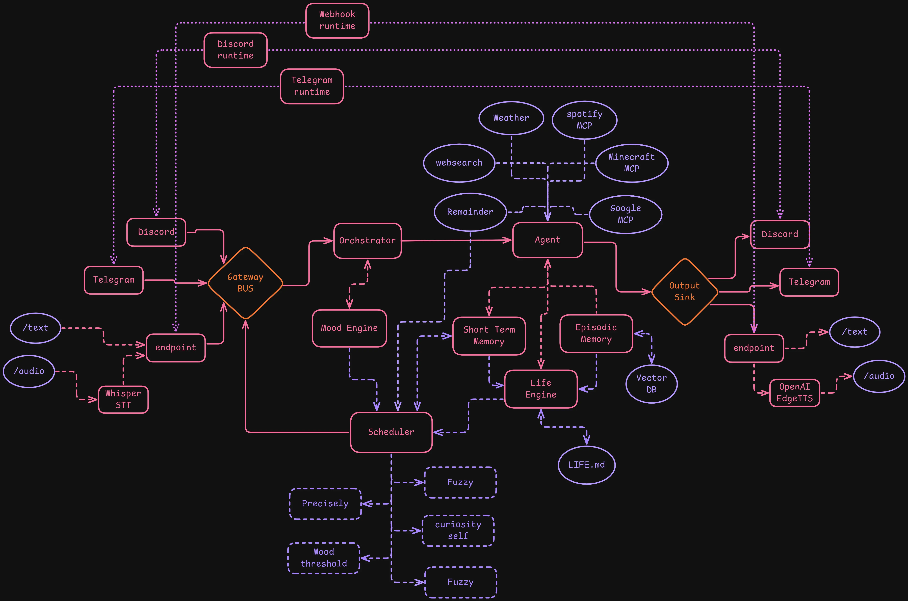

# Architecture

Kayori v2 uses a modular, adapter-based architecture for flexibility and extensibility.

## Overview



**Message Flow:**
```
Input → Gateway BUS → Orchestrator → Agent → Output Sink → Response
```

## Core Components

### Gateway BUS

Central message bus that decouples input from processing:

- **InMemoryMessageBus** - Default, low-latency in-memory queue
- **RedisMessageBus** - Distributed, persistent queue (optional)

### Orchestrator

The `AgentOrchestrator` manages the processing pipeline:

1. Consumes messages from the bus
2. Loads mood state from state store
3. Calls the ReAct agent with context
4. Builds outbound messages
5. Sends to output sink

### Agent

LangGraph ReAct agent that:

- Maintains per-thread conversation history (short-term memory)
- Executes tools (Weather, Reminder, Spotify, Tavily Search, MCP tools)
- Returns text responses
- Logs tool calls for auditing

### Memory Systems

- **Short-Term Memory** - In-memory conversation history per thread
- **Episodic Memory** - Long-term memory via Pinecone vector database
- **Graph Memory** - Knowledge graph via Neo4j for structured relationships

### Mood Engine

Analyzes user messages and adjusts emotional state:

- Fast emotion delta classification from user text
- Relationship-style long emotions updated more slowly
- Shared reinforce/conflict graph for emotion propagation
- Separate drift and spike behavior for ongoing mood dynamics

See [Mood Engine](mood-engine.md) for the detailed reasoning and logic.

### Scheduler

Drives proactive behaviors:

- **Fuzzy Scheduling** - Approximate timing with flexibility
- **Precise Scheduling** - Exact timestamp-based execution
- **Curiosity Triggers** - Self-driven exploration
- **Mood Thresholds** - Actions triggered by mood changes

### Output Sink

Routes outbound messages:

- **Direct Mode** - Reply to the same platform (Discord → Discord)
- **Multi Mode** - Broadcast to all configured outputs

## Platform Adapters

### Input Adapters

- `DiscordInputAdapter` - Discord message ingestion
- `TelegramInputAdapter` - Telegram message ingestion
- `ConsoleInputGateway` - Console/CLI input
- `WebhookInputAdapter` - REST/webhook input with STT support

### Output Adapters

- `DiscordOutputAdapter` - Discord message delivery
- `TelegramOutputAdapter` - Telegram message delivery
- `ConsoleOutputAdapter` - Console output
- `WebhookOutputAdapter` - Webhook delivery with TTS support

### Audio Pipeline

- **Whisper STT** - Speech-to-text transcription
- **EdgeTTS** - Text-to-speech synthesis

## Tools

### Built-in Tools

- `WeatherTool` - Weather information via geopy
- `ReminderTool` - Schedule reminders and delayed messages
- `SpotifyTool` - Spotify integration
- `TavilySearch` - Web search

### MCP Tools

- Weather, Spotify, Minecraft, Google, Websearch, Reminder

## State Store

Manages application state:

- **InMemoryStateStore** - Default, volatile storage
- **RedisStateStore** - Persistent storage (optional)

Stores mood state, location data, and user preferences.

## Extending Kayori

### Adding a New Input Adapter

1. Create a class implementing `InputAdapter` protocol
2. Publish `MessageEnvelope` to the bus
3. Register in `examples/main.py`

### Adding a New Tool

1. Extend `langchain_core.tools.BaseTool`
2. Implement `_arun` method
3. Add to agent's tool list

### Custom Output Routing

Modify `OutputSink._select_outputs()` for custom routing logic.
